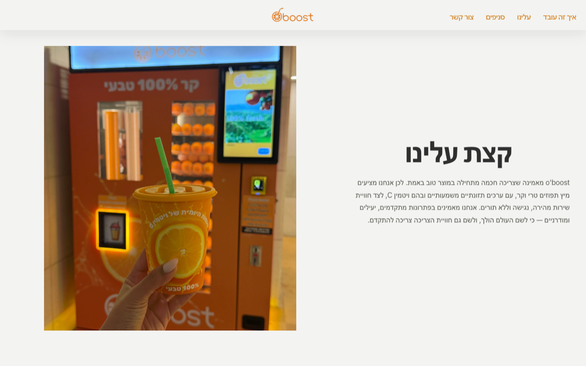

# OBoost Marketing Website

## Live Website

https://nadavkaufman.github.io/o-boost/

## Screenshot

## Overview

The public-facing marketing website for **OBoost**, a company operating automated fresh orange juice vending machines.

The website introduces the company's solution, explains how it works, and presents its benefits to potential customers through a clean, modern, and responsive interface.

**Related project:** OBoost Manager — the company's internal operations management system.

---

## Business goal

The website serves as OBoost's public presence, helping potential customers understand the product, explore its benefits, and contact the company.

---

## Main features

- Responsive landing page
- Hero section
- Product overview
- "How it works" section
- Locations section
- FAQ section
- Contact section

---

## Technology stack

- HTML5
- CSS3
- Vanilla JavaScript

---

## Architecture

A responsive single-page website built with semantic HTML, modular CSS, and vanilla JavaScript without external frameworks.

---

## What I worked on

- Designed and developed the entire website from scratch.
- Built the layout and styling using HTML and CSS.
- Implemented responsive behavior across desktop and mobile devices.
- Added interactive UI elements with JavaScript.
- Improved spacing, visual hierarchy, and overall user experience.

---

## Notes

The website content is written in Hebrew.
